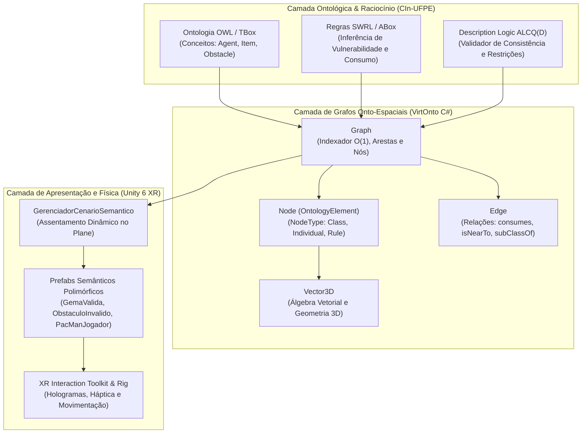

# Pac-Man Semântico (Semantic Pac-Man) 🕹️🧠

[-blue.svg?logo=unity)](https://unity.com/)
[](https://docs.unity3d.com/Packages/com.unity.xr.interaction.toolkit@latest)
[-orange.svg)](https://www.w3.org/standards/semanticweb/ontology)
[](https://github.com/lanalcantara/Pac-man-Semantico)
[](https://www.cin.ufpe.br/)

---

## 1. Descrição Geral

O **Pac-Man Semântico** é um projeto de pesquisa aplicada desenvolvido no **Centro de Informática da Universidade Federal de Pernambuco (CIn-UFPE)**. A proposta central do projeto é integrar modelos formais de conhecimento da **Web Semântica (ontologias OWL e regras inferenciais SWRL)** a motores de jogos 3D modernos em **Realidade Estendida (XR)** com **Unity 6**.

Tradicionalmente, os jogos eletrônicos empregam máquinas de estados finitos (FSM) ou árvores de comportamento rígidas e engessadas para governar a dinâmica de entidades e agentes (como Pac-Man e os fantasmas Blinky, Pinky, Inky e Clyde). O **Pac-Man Semântico** substitui essa abordagem rígida por um **motor de raciocínio ontológico dinâmico baseado em Lógica de Descrição (Description Logic - $\mathcal{ALCQ}(D)$)**:

- **Classificação Dinâmica de Entidades:** Gemas válidas (Pac-Dots e pílulas especiais) e obstáculos (inconsistências semânticas e fantasmas hostis) são classificados e avaliados em tempo real segundo regras de consistência da TBox (Terminological Box) e axiomas da ABox (Assertional Box).
- **Transições de Estado por Inferência:** A vulnerabilidade dos fantasmas e a dinâmica de jogo deixam de ser variáveis booleanas isoladas e passam a ser inferências dedutivas de regras SWRL (ex: quando o jogador consome uma gema especial e está em proximidade espacial simétrica com o agente fantasma).
- **Imersão Espacial XR:** Interação tridimensional por toque direto de controladores XR ou mira háptica por feixe laser (Raycast) com HUD holográfico espacial e resposta visual polida.

---

## 2. Arquitetura e Stack Tecnológica



### Stack Tecnológica
- **Engine 3D & XR:** Unity 6 (`6000.3.24f1`), Universal Render Pipeline (URP), XR Interaction Toolkit, OpenXR, Input System.
- **Lógica e Raciocínio Formal:** Lógica de Descrição $\mathcal{ALCQ}(D)$, Web Ontology Language (OWL 2), Semantic Web Rule Language (SWRL).
- **Arquitetura de Grafos (VirtOnto em C#):**
  - **`Vector3D`:** Estrutura matemática 3D com operadores algébricos (`+`, `-`, `*`, `/`), cálculo de distância euclidiana (`DistanceTo`) e conversão implícita direta com `UnityEngine.Vector3`.
  - **`OntologyElement`:** Classe base abstrata provendo identificação canônica (`Id`), rótulo ontológico (`Label`), metadados e coloração polimórfica (`GetDisplayColor`).
  - **`Node`:** Herdeiro de `OntologyElement` parametrizado por `NodeType` (`CLASS`, `INDIVIDUAL`, `PROPERTY`, `RULE`, `AXIOM`), contendo posições espaciais `Vector3D`, física (`Velocity`, `Mass`), expressões de Description Logic e referência direta a instâncias de `GameObject`.
  - **`Edge`:** Modela arestas direcionadas e axiomas simétricos com peso (`Weight`) e tipo de relação (`rdfs:subClassOf`, `consumes`, `isNearTo`, `satisfies`, `violates`).
  - **`Graph`:** Gerenciador central do grafo com dicionário de nós e lista de arestas indexadas em tempo constante $O(1)$, suporte a carga de `CenarioSemanticoDTO`, conversão JSON VirtOnto e motor de avaliação de regras SWRL.

---

## 3. Estrutura do Repositório

```text
Come-come semântico/
├── Assets/
│   ├── Editor/                              # Ferramentas do Unity Editor e suíte de testes
│   │   ├── GeradorPrefabsEditor.cs          # Construtor automatizado de prefabs 3D e Rig XR
│   │   └── TestesVirtOntoEPacManSemantico.cs # Testes unitários do VirtOnto e cálculo de Bounds
│   ├── Materials/                           # Materiais URP estilizados e com emissão neon
│   ├── Prefabs/                             # Modelos 3D das entidades semânticas
│   │   ├── GemaValida.prefab               # Pac-Dot / Pílula com aura brilhante
│   │   ├── ObstaculoInvalido.prefab         # Fantasma Blinky com olhos móveis
│   │   └── PacManJogador.prefab            # Personagem Pac-Man com mandíbulas animadas
│   ├── Resources/
│   │   └── Prefabs/                         # Prefabs para contingência e carregamento dinâmico
│   ├── Scenes/
│   │   └── SampleScene.unity                # Cena principal configurada com Rig XR e Plane
│   ├── Scripts/                             # Classes centrais do modelo VirtOnto e Motor Semântico
│   │   ├── VirtOntoModels.cs                # Classes fundamentais: Vector3D, Node, Edge, Graph
│   │   ├── MotorRaciocinioSemantico.cs      # Motor de regras SWRL e gestão de estados dos agentes
│   │   └── ControladorJogador.cs            # Controlador híbrido do jogador (WASD + XR Origin)
│   ├── BackendOntologiaBridge.cs            # Ponte para backend C++ (P/Invoke nativo) e mock DL
│   ├── ControladorXRJogador.cs              # Locomoção contínua e teletransporte XR
│   ├── DadoInstanciaSemantica.cs            # DTOs de serialização e transferência semântica
│   ├── GerenciadorCenarioSemantico.cs       # Gestor central de spawn, Bounds e assentamento no chão
│   ├── GerenciadorEfeitosJuice.cs           # Feedback háptico, partículas e efeitos visuais
│   ├── GerenciadorInstancia.cs              # Fachada e ciclo de vida da instância semântica
│   ├── HUDHolograficoXR.cs                  # Interface holográfica VR para axiomas e regras DL
│   ├── IInstanciaSemantica.cs               # Interface do indivíduo ontológico (ABox)
│   ├── InstanciaSemanticaBase.cs            # Classe base polimórfica com eventos e detecção XR
│   ├── InteracaoEspacialXR.cs               # Interação física por toque e laser raycast
│   ├── OntologiaExemplo_DL.json             # Exemplo serializado de ontologia ALCQ(D)
│   ├── OntologiaPacManSemantico.puml        # Diagrama formal da ontologia em PlantUML
│   └── RotacaoFlutuante.cs                  # Rotação suave no eixo Y sincronizada com o piso
├── MotorJava/                               # Microsserviço REST em Spring Boot (Java 17)
│   ├── pom.xml                              # Gerenciador de dependências Maven
│   ├── README.md                            # Documentação específica da API REST
│   └── src/
│       ├── main/java/com/virtonto/
│       │   ├── VirtOntoApplication.java     # Ponto de entrada do serviço Spring Boot
│       │   ├── config/CorsConfig.java       # Configuração de CORS para Unity / XR
│       │   ├── controller/OntologyController.java # Endpoints REST para nós, arestas e SWRL
│       │   └── model/                       # Modelos VirtOnto em Java (Vector3D, Node, Edge, Graph)
│       └── test/java/com/virtonto/          # Testes automatizados da API
├── ProjectSettings/                         # Configurações de física, URP, XR e packages
├── README.md                                # Documentação técnica principal do repositório
└── Come-come semântico.slnx                 # Solução C# do projeto
```

---

## 4. Como Executar

### Pré-requisitos
1. **Unity Hub** e **Unity Editor 6000.3.24f1 (Unity 6)** instalados.
2. **Java JDK 17** e **Apache Maven 3.9+** (para o backend Spring Boot).
3. Módulo de suporte a **Windows Build Support** (e opcionalmente OpenXR para dispositivos VR como Meta Quest, HTC Vive ou Valve Index).
4. **Git** configurado localmente.

### Passos de Execução
1. **Clonar o Repositório:**
   ```bash
   git clone https://github.com/lanalcantara/Pac-man-Semantico.git
   cd Pac-man-Semantico
   ```

2. **Abrir o Projeto no Unity:**
   - No Unity Hub, clique em **Add** (Adicionar projeto) e selecione a pasta clonada.
   - Abra o projeto utilizando o editor **Unity 6 (6000.3.24f1)**.

3. **Carregar a Cena Principal:**
   - No painel *Project*, navegue até `Assets/Scenes/` e abra a cena **`SampleScene.unity`**.

4. **Executar a Suíte de Testes no Editor (Opcional):**
   - Na barra de menus superior do Unity, clique em:
     **`Pac-Man Semântico -> 4. Executar Testes de Validação (VirtOnto + Bounds + Prefabs)`**.
   - O console exibirá a confirmação de que todos os testes de álgebra vetorial, nós, arestas, grafo e assentamento no chão passaram com 100% de sucesso.

5. **Iniciar o Jogo (Play Mode):**
   - Pressione o botão **Play** no Unity Editor.
   - O `GerenciadorCenarioSemantico` executará a leitura ontológica, indexará o grafo VirtOnto e distribuirá as gemas válidas e obstáculos assentados perfeitamente sobre a superfície do piso (`Plane`).
   - Você pode controlar o Pac-Man através do Rig XR (ou via teclado/mouse no simulador de XR Origin).

---

## 5. Destaques da Implementação

- **Assentamento Procedural no Chão:** O cálculo de posicionamento não utiliza alturas fixas arbitrárias; em vez disso, mede a distância dinâmica entre o Pivot e o ponto mais baixo da malha (`bounds.min.y`), garantindo que tanto gemas quanto obstáculos fiquem com a base exatamente nivelada com a face superior do `Plane`.
- **Salvaguarda contra Missing References:** O gestor verifica ativamente o estado de cada prefab no Inspector e recupera referências quebradas automaticamente de `Assets/Resources/Prefabs/` através de `OnValidate()`, possuindo geradores procedurais de contingência caso o asset seja excluído.
- **Raciocínio Dinâmico SWRL:** Avaliação contínua de proximidade simétrica entre nós (`isNearTo`), permitindo que a proximidade física no espaço virtual dispare inferências lógicas na base de conhecimento.

---

## 6. Autoria e Contexto Acadêmico

Este projeto integra as investigações do programa de **Mestrado em Ciência da Computação** do **Centro de Informática da Universidade Federal de Pernambuco (CIn-UFPE)**.

- **Pesquisadora / Autora:** Lana Alcântara ([GitHub](https://github.com/lanalcantara))
- **Instituição:** Centro de Informática — Universidade Federal de Pernambuco (CIn-UFPE)
- **Área de Pesquisa:** Engenharia de Ontologias, Web Semântica, Lógicas de Descrição ($\mathcal{ALCQ}(D)$), Realidade Estendida (XR) e Sistemas Inteligentes Interativos.

---

## 7. Licença

Este projeto está sob a licença [MIT](LICENSE), sendo livre para uso acadêmico, científico e experimental mediante citação da fonte e dos autores.
