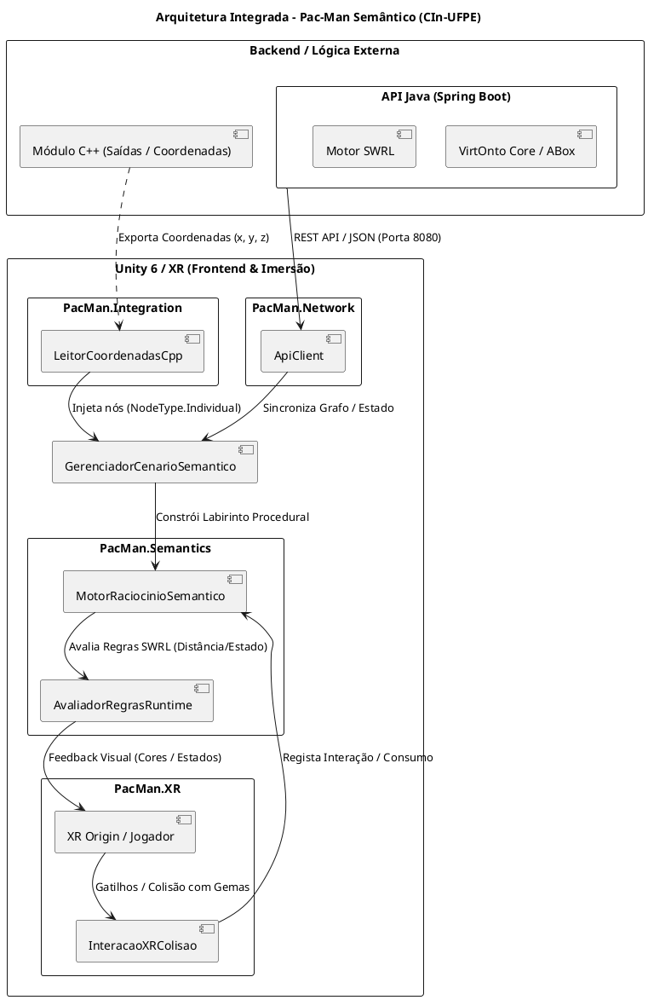

# Pac-Man Semântico (Semantic Pac-Man) 🕹️🧠

[-blue.svg?logo=unity)](https://unity.com/)
[](https://docs.unity3d.com/Packages/com.unity.xr.interaction.toolkit@latest)
[](https://spring.io/projects/spring-boot)
[-orange.svg)](https://www.w3.org/standards/semanticweb/ontology)
[](https://github.com/lanalcantara/Pac-man-Semantico)
[](https://www.cin.ufpe.br/)

---

## 1. Descrição Geral

O **Pac-Man Semântico** é um projeto de pesquisa aplicada desenvolvido no âmbito do programa de **Mestrado em Ciência da Computação** do **Centro de Informática da Universidade Federal de Pernambuco (CIn-UFPE)**. A proposta central do projeto é integrar modelos formais de conhecimento da **Web Semântica (ontologias OWL e regras inferenciais SWRL)** a uma **arquitetura distribuída e imersiva**:

- **Backend em Java (Spring Boot / VirtOnto):** Microsserviço REST responsável pelo gerenciamento centralizado do grafo ontológico (TBox e ABox), disponibilizando endpoints para sincronização de nós, arestas e estado lógico com suporte a CORS.
- **Módulo de Coordenadas em C++:** Motor nativo de processamento espacial que exporta coordenadas e pontos de saída no labirinto para enriquecer o grafo semântico.
- **Frontend Imersivo em Unity 6 com Realidade Virtual (XR):** Experiência em RV com OpenXR e XR Interaction Toolkit, incorporando um motor de raciocínio ontológico em tempo de execução ($\mathcal{ALCQ}(D)$ e SWRL), locomoção suave (thumbstick/WASD), cálculo de distâncias euclidianas em tempo real e atualização dinâmica de materiais e iluminação dos agentes (fantasmas e jogador).

---

## 2. Arquitetura Integrada do Sistema

O diagrama abaixo ilustra a integração de ponta a ponta entre a camada de backend, o módulo de geometria C++ e os subsistemas em Unity 6 / XR:



---

## 3. Estrutura do Repositório

```text
Come-come semântico/
├── Assets/
│   ├── Editor/                              # Suíte de testes automatizados e geradores de prefabs
│   │   ├── GeradorPrefabsEditor.cs          # Construtor automatizado de prefabs 3D e Rig XR
│   │   └── TestesVirtOntoEPacManSemantico.cs # Bateria de 11 testes automatizados (C#, SWRL, XR, C++)
│   ├── Materials/                           # Materiais URP com shaders lit e emissão neon
│   ├── Prefabs/                             # Modelos 3D das entidades semânticas
│   │   ├── GemaValida.prefab               # Pac-Dot / Pílula com rotação suave
│   │   ├── ObstaculoInvalido.prefab         # Fantasma Blinky com olhos e reações
│   │   └── PacManJogador.prefab            # Personagem Pac-Man com mandíbulas animadas
│   ├── Resources/
│   │   └── Prefabs/                         # Prefabs para contingência e fallback procedural
│   ├── Scenes/
│   │   └── SampleScene.unity                # Cena principal com Rig XR e labirinto procedural
│   ├── Scripts/                             # Módulos centrais de lógica ontológica e XR
│   │   ├── VirtOntoModels.cs                # Classes fundamentais: Vector3D, Node, Edge, Graph
│   │   ├── MotorRaciocinioSemantico.cs      # Motor de regras SWRL e gestão de estados dos agentes
│   │   ├── ControladorJogador.cs            # Locomoção contínua física do jogador (WASD + XR)
│   │   ├── Integration/                     # Módulo de ponte com sistemas externos C++
│   │   │   └── LeitorCoordenadasCpp.cs      # Adaptador de coordenadas 3D para nós VirtOnto
│   │   ├── Network/                         # Módulo de rede HTTP e cliente REST
│   │   │   └── ApiClient.cs                 # Cliente UnityWebRequest para API Spring Boot
│   │   ├── Semantics/                       # Avaliação contínua de regras em tempo de execução
│   │   │   └── AvaliadorRegrasRuntime.cs    # Avaliação SWRL contínua e validação de altura do XR Origin
│   │   └── XR/                              # Interações espaciais e colisões em Realidade Virtual
│   │       └── InteracaoXRColisao.cs        # Deteção física de gatilhos, som e consumo ontológico
│   ├── ControladorXRJogador.cs              # Locomoção contínua e suporte a simulador desktop
│   ├── GerenciadorCenarioSemantico.cs       # Gestor central de spawn, Bounds e assentamento no chão
│   ├── GerenciadorEfeitosJuice.cs           # Feedback háptico, partículas e efeitos visuais
│   ├── HUDHolograficoXR.cs                  # Interface holográfica VR para axiomas e regras DL
│   └── InstanciaSemanticaBase.cs            # Classe base polimórfica para entidades no labirinto
├── MotorJava/                               # Microsserviço REST em Spring Boot (Java 17)
│   ├── pom.xml                              # Gerenciador de dependências Maven
│   ├── README.md                            # Documentação específica da API REST
│   └── src/                                 # Código-fonte Java (VirtOntoApplication, Controller, Model)
├── ProjectSettings/                         # Configurações do Unity 6 (URP, XR, Physics)
├── README.md                                # Documentação oficial do projeto
└── Come-come semântico.slnx                 # Solução C# do projeto
```

---

## 4. Instruções de Execução e Integração

### Pré-requisitos
- **Java JDK 17** e **Apache Maven 3.9+**.
- **Unity Hub** e **Unity Editor 6000.3.24f1 (Unity 6)** com Universal Render Pipeline (URP).
- **Git** configurado.

---

### Passo 1: Levantar o Backend Java (Spring Boot)

Navegue até o diretório `MotorJava/` e inicie o serviço REST:

```bash
# Opção A: Executar via Maven
cd MotorJava
mvn spring-boot:run

# Opção B: Executar via JAR pré-compilado
java -jar target/pacman-semantic-service-1.0.0-SNAPSHOT.jar
```

O servidor iniciará na porta **`8080`**. Você pode validar a conexão abrindo o navegador ou via terminal:

```bash
curl http://localhost:8080/api/ontology/status
```
> **Resposta esperada:** JSON confirmando status `UP`, nós ontológicos indexados e cabeçalhos CORS liberados para o Unity.

---

### Passo 2: Executar e Sincronizar no Unity 6

1. Abra o projeto no **Unity 6 (6000.3.24f1)** através do Unity Hub.
2. No painel *Project*, abra a cena: **`Assets/Scenes/SampleScene.unity`**.
3. No objeto **`GerenciadorCenario`** da hierarquia:
   - Defina a opção **`Origem Dados Ontologia`** como **`BackendJavaSpringBoot`** (ou use o menu de contexto: botão direito no componente -> `Pac-Man Semântico/Sincronizar com Backend Java (Spring Boot)`).
   - Para importar os pontos do módulo C++, utilize o menu de contexto -> `Pac-Man Semântico/Importar Coordenadas C++`.
4. Pressione o botão **Play** no Unity Editor:
   - O `ApiClient` consumirá o grafo do Spring Boot e instanciará o labirinto proceduralmente.
   - O `LeitorCoordenadasCpp` injetará os pontos de saída com a tag `#00FFFF` (Ciano).
   - O `AvaliadorRegrasRuntime` avaliará continuamente a proximidade do Pac-Man (`XR Origin`) com os fantasmas, alterando dinamicamente suas cores:
     - 🔴 **Vermelho (`Color.red`)**: Fantasma agressivo em perseguição ($distância < 2.0m$).
     - 🔵 **Azul (`Color.blue`)**: Fantasma vulnerável após consumo de Power Pellet ($distância < 3.0m$).
     - ⚪ **Branco (`Color.white`)**: Fantasma em patrulha.
   - O componente `InteracaoXRColisao` detectará colisões com as gemas via controladores XR ou teclado (WASD), emitindo áudio e registrando a relação semântica `consumes` no grafo.

---

### Passo 3: Executar a Suíte de Testes Automatizados

No menu superior do Unity Editor, clique em:
**`Pac-Man Semântico -> 4. Executar Testes de Validação (VirtOnto + Bounds + Prefabs)`**.

A suíte executará **11 baterias de testes automatizados**:
1. Álgebra vetorial e conversão de `Vector3D`.
2. Hierarquia ontológica e nós `OntologyElement`, `Node`, `Edge`.
3. Indexação e regras SWRL no `Graph` VirtOnto.
4. Assentamento procedural de prefabs no piso (`Plane`).
5. Salvaguarda e recuperação contra *Missing Prefabs*.
6. Transições de estado do `MotorRaciocinioSemantico` (`Patrol`, `Aggressive`, `Vulnerable`).
7. Locomoção e eventos do `ControladorJogador`.
8. Serialização JSON e DTOs de rede do `ApiClient`.
9. Inferência visual contínua e validação de altitude do `AvaliadorRegrasRuntime`.
10. Deteção física e consumo ontológico no `InteracaoXRColisao`.
11. Injeção e conversão de coordenadas C++ no `LeitorCoordenadasCpp`.

---

## 5. Autoria e Contexto Acadêmico

Este projeto integra as investigações do programa de **Mestrado em Ciência da Computação** do **Centro de Informática da Universidade Federal de Pernambuco (CIn-UFPE)**.

- **Pesquisadora / Autora:** Lana Alcântara ([GitHub](https://github.com/lanalcantara))
- **Instituição:** Centro de Informática — Universidade Federal de Pernambuco (CIn-UFPE)
- **Área de Pesquisa:** Engenharia de Ontologias, Web Semântica, Lógicas de Descrição ($\mathcal{ALCQ}(D)$), Realidade Estendida (XR), Sistemas Inteligentes Interativos e Computação Gráfica.

---

## 6. Licença

Este projeto está sob a licença [MIT](LICENSE), sendo livre para uso acadêmico, científico e experimental mediante citação da fonte e dos autores.
